# 🍔 Real-Time Food Delivery Data Analysis using AWS (with CI/CD Pipeline)

This project demonstrates a **real-time data engineering pipeline** built on **AWS**, designed to simulate, process, and analyze food delivery data streams.
It integrates multiple AWS services for **data ingestion, transformation, warehousing, and visualization**, orchestrated through **Airflow** and automated with **CodeBuild CI/CD**.

---

## 🏗️ Architecture Overview

Here’s the high-level architecture of the project pipeline:

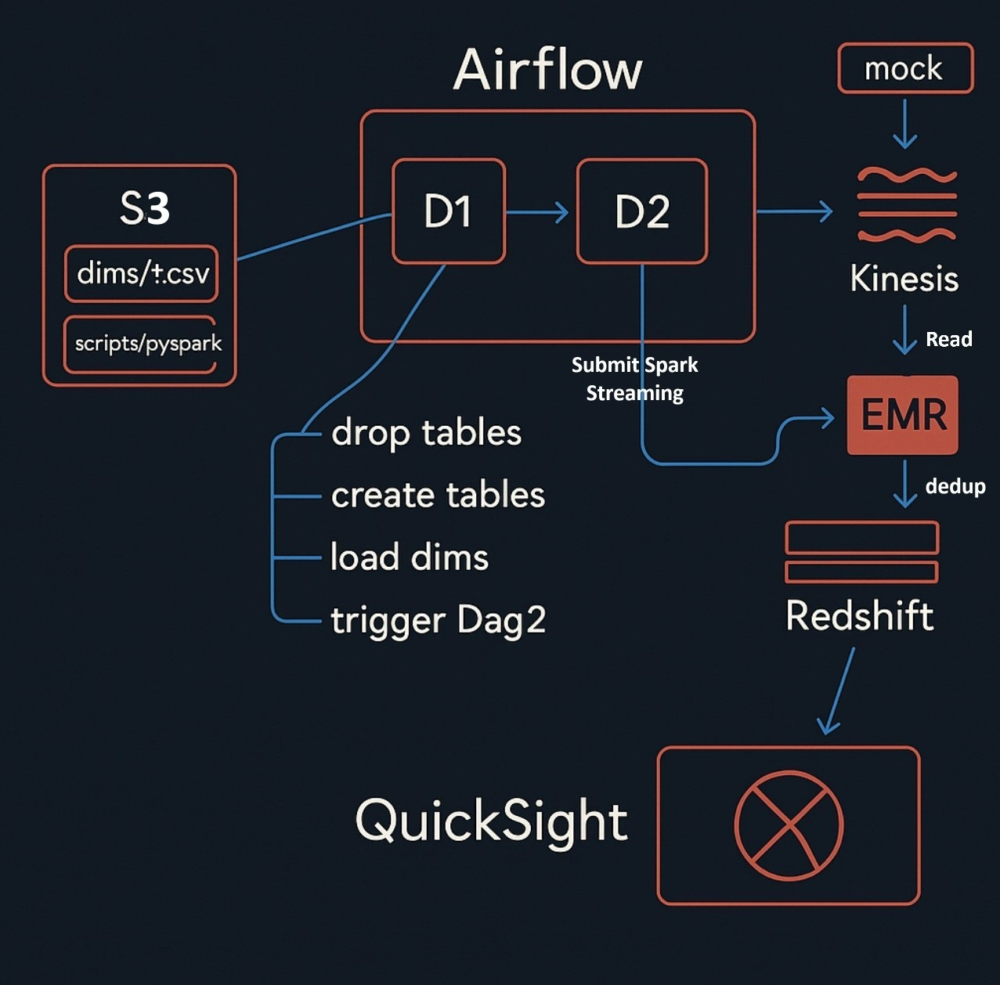

---

## 🚀 Project Overview

This project simulates a food delivery system generating **real-time streaming order data** that flows through a complete AWS data pipeline:

* **AWS Kinesis** → Stream live order data
* **AWS EMR (Spark Streaming)** → Process data in near real-time
* **AWS Redshift** → Store transformed analytical data
* **AWS Managed Airflow (MWAA)** → Orchestrate workflows
* **AWS QuickSight** → Visualize business insights
* **AWS CodeBuild** → Automate deployments (CI/CD)
* **Amazon S3** → Store scripts, DAGs, and data assets

---

## 🧠 Architecture Workflow

1️⃣ **Mock Data Generator** → publishes data to **Kinesis Stream**
2️⃣ **Airflow (DAG 1)** → creates Redshift schema, dimension & fact tables, loads data from S3
3️⃣ **Airflow (DAG 2)** → submits **PySpark Streaming** job to EMR
4️⃣ **EMR Cluster** → reads from Kinesis, deduplicates, and writes clean data into Redshift
5️⃣ **QuickSight** → visualizes order metrics from Redshift

---

## 🧩 Tech Stack

| Layer             | Technology                | Purpose                               |
| ----------------- | ------------------------- | ------------------------------------- |
| **Ingestion**     | AWS Kinesis Stream        | Real-time data ingestion              |
| **Processing**    | AWS EMR (Spark Streaming) | Transform and stream data             |
| **Storage**       | Amazon S3                 | Store CSVs, JARs, and PySpark scripts |
| **Orchestration** | AWS Managed Airflow       | Manage DAG workflows                  |
| **Warehouse**     | AWS Redshift              | Analytical data store                 |
| **Visualization** | AWS QuickSight            | BI dashboards                         |
| **CI/CD**         | AWS CodeBuild             | Automate deployments                  |

---

## 🧱 Project Structure

```
FOOD-DELIVER-ANALYSIS-USING-AWS/
│
├── dags/
│   ├── airflow_to_emr.py                # Submits PySpark job to EMR
│   ├── dim_load_dag.py                  # Creates and loads Redshift tables
│
├── data_for_dims/
│   ├── dimCustomers.csv
│   ├── dimDeliveryRiders.csv
│   └── dimRestaurants.csv
│
├── jars/
│   └── redshift-jdbc42-2.1.0.12.jar
│
├── scripts/
│   └── pyspark_streaming.py             # PySpark streaming script
│
├── project-screenshots/
│   └── -----                            # list of diagrams
│
├── buildspec.yml                        # AWS CodeBuild configuration
├── dwh_create_table_commands.sql        # Redshift DDL
├── mock_data_generator.py               # Mock data publisher to Kinesis
└── README.md                            # Project documentation
```

---

## ⚙️ Data Flow Explanation

### 1️⃣ **Mock Data Generation**

`mock_data_generator.py` produces synthetic food delivery orders using **Faker** and streams them to **AWS Kinesis** (`incoming-food-order-data`).

📸 *Mock data streaming*
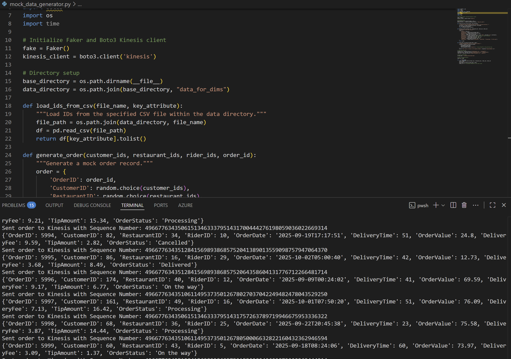

---

### 2️⃣ **Airflow DAG - Create and Load Dimensions**

The DAG `dim_load_dag.py`:

* Creates Redshift schema & tables
* Loads dimension data from S3
* Triggers the streaming DAG

📸 *Airflow DAG to Create & Load Dimensions*
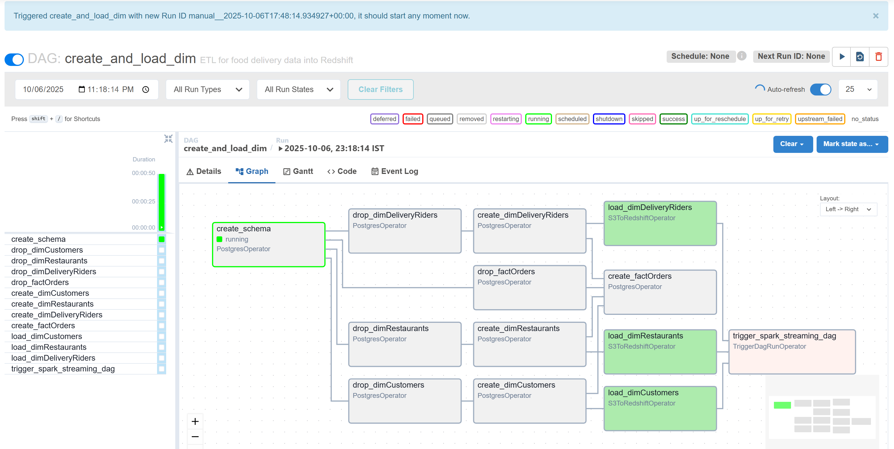

📸 *Running and Success State*
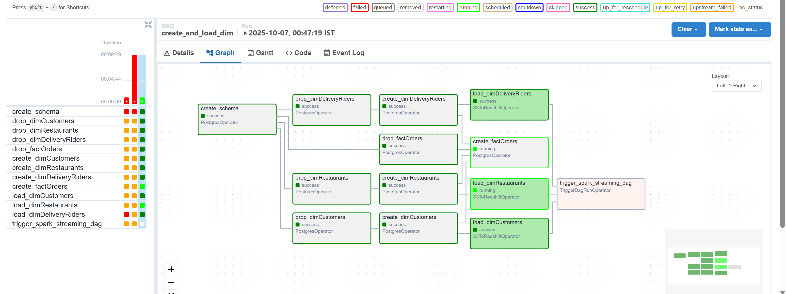
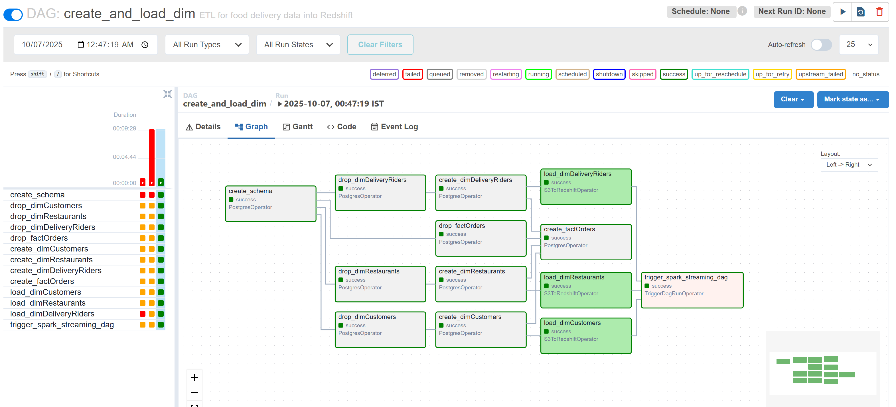

---

### 3️⃣ **Airflow DAG - Submit PySpark Job to EMR**

`airflow_to_emr.py` submits a Spark job to EMR for real-time Kinesis processing.

📸 *Airflow Submitting EMR Job*
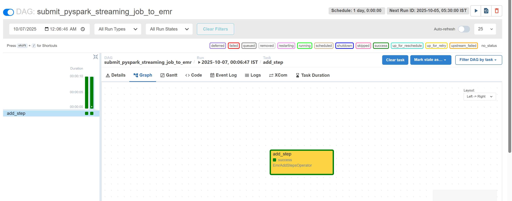

---

### 4️⃣ **EMR Streaming and Processing**

EMR consumes data from Kinesis, performs **schema validation** and **deduplication**, and writes data into **Redshift**.

📸 *EMR Steps Executing*
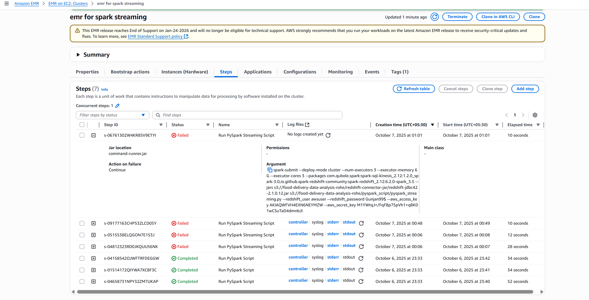
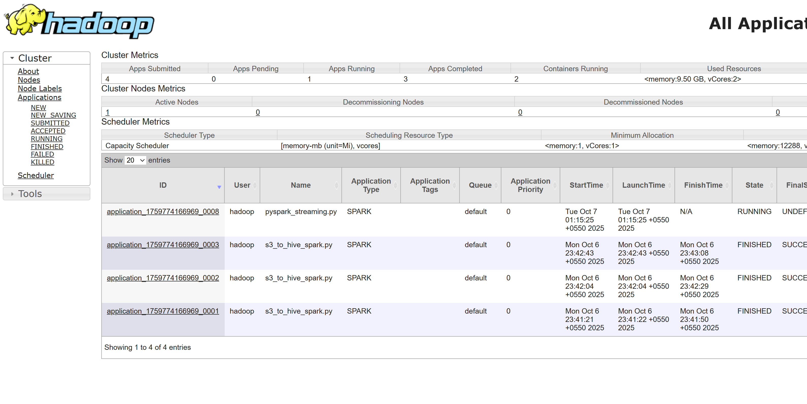

---

### 5️⃣ **Redshift Data Warehouse**

Initially empty:
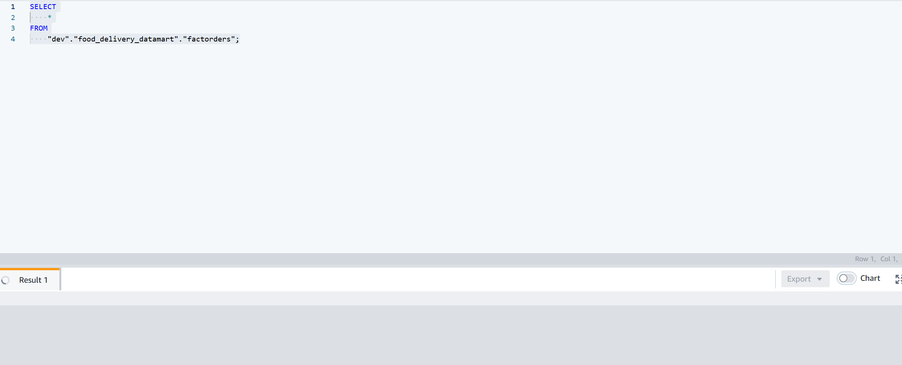

After streaming job completes:
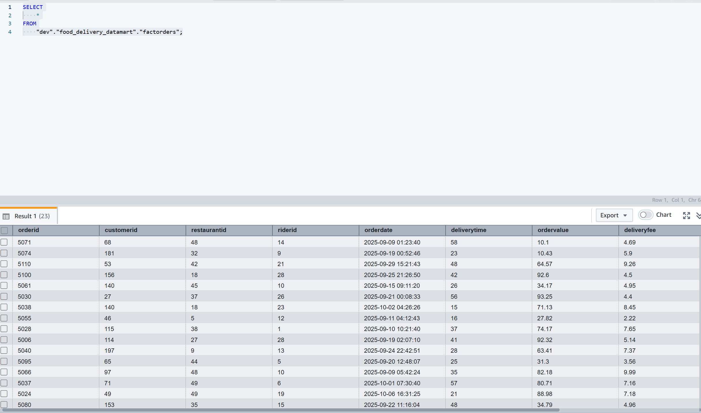

---

### 6️⃣ **QuickSight Visualization**

AWS QuickSight is used to analyze and visualize the aggregated data from Redshift.

📸 *QuickSight Dashboard (Cuisine Type by Order Value)*
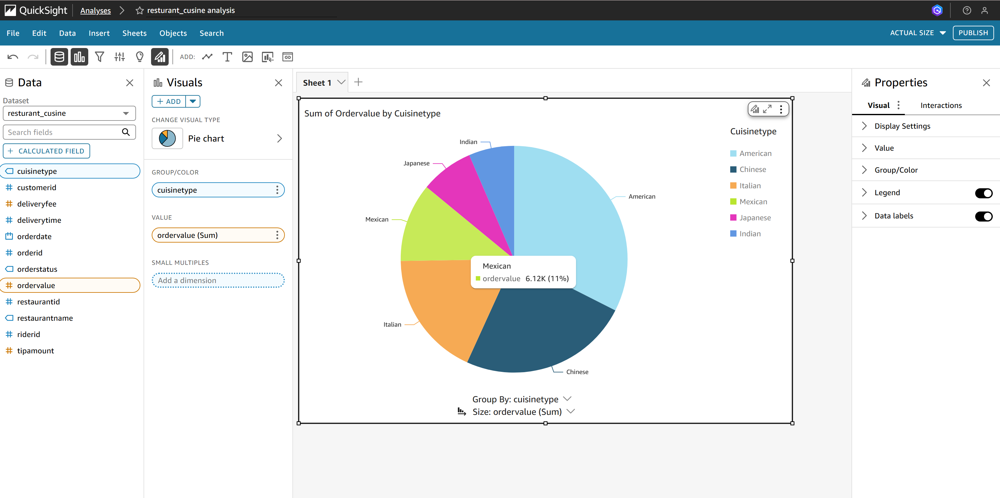

📸 *Cuisine Type by Order Value & Delivery Time*
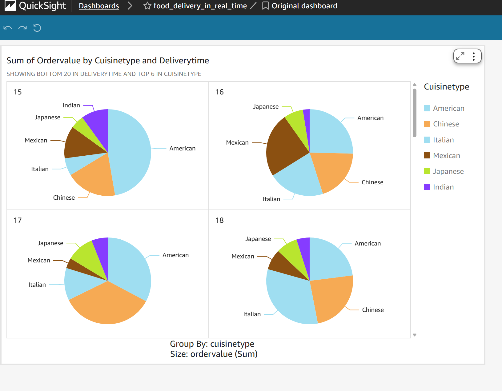

---

### 7️⃣ **CI/CD with AWS CodeBuild**

Automated deployment occurs when code merges from `dev` → `main`.

📸 *CodeBuild Deployment History*
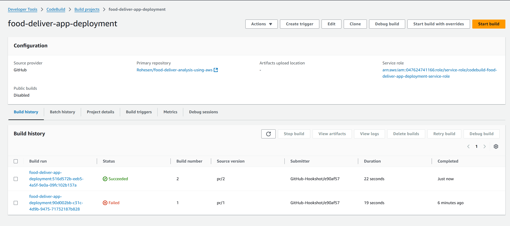

📸 *S3 DAG Folder Sync*


📸 *S3 Dims Folder*
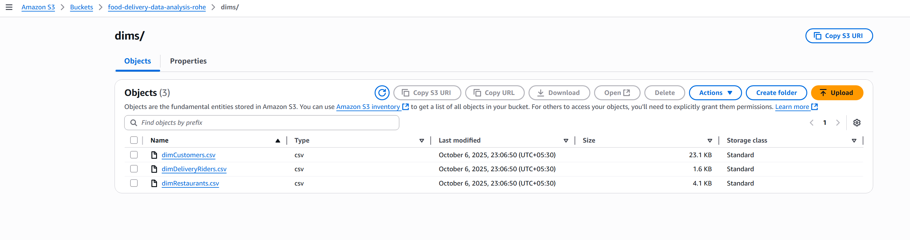

---

## 📊 Redshift Schema

### Schema: `food_delivery_datamart`

| Table                 | Type      | Description                  |
| --------------------- | --------- | ---------------------------- |
| **dimCustomers**      | Dimension | Customer details             |
| **dimRestaurants**    | Dimension | Restaurant metadata          |
| **dimDeliveryRiders** | Dimension | Rider details                |
| **factOrders**        | Fact      | Real-time order transactions |

---

## 🧪 How to Run the Project

### Step 1️⃣ — **Provision AWS Resources**

* Create required S3 buckets:

  * `airflow-managed-rohe`
  * `food-delivery-data-analysis-rohe`
  * `stream-checkpointing-rohe`
  * `redshift-temp-data-rohe`
* Create:

  * **Kinesis Data Stream** (`incoming-food-order-data`)
  * **Redshift Cluster**
  * **EMR Cluster** (with Spark)
  * **MWAA Environment**

---

### Step 2️⃣ — **Configure Airflow Variables**

Add the following in **MWAA Variables**:

```
redshift_user
redshift_password
aws_access_key
aws_secret_key
```

---

### Step 3️⃣ — **Deploy using CodeBuild**

Merging from `dev` → `main` triggers automatic upload:

* DAGs → `s3://airflow-managed-rohe/dags/`
* Dim Data → `s3://food-delivery-data-analysis-rohe/dims/`
* Scripts → `s3://food-delivery-data-analysis-rohe/pyspark_script/`
* JARs → `s3://food-delivery-data-analysis-rohe/redshift-connector-jar/`

---

### Step 4️⃣ — **Trigger Airflow DAGs**

1. Trigger **`create_and_load_dim`** DAG.
2. Once dimensions are loaded, it triggers **`submit_pyspark_streaming_job_to_emr`**.
3. Run **`mock_data_generator.py`** to publish mock orders into Kinesis.

---

### Step 5️⃣ — **Visualize in QuickSight**

* Connect QuickSight to Redshift.
* Build dashboards showing KPIs like:

  * Order value by cuisine
  * Average delivery time
  * Top restaurants by revenue
  * Order status breakdown

---

## 🧰 Tools & Services Summary

| Category      | Service        | Purpose                    |
| ------------- | -------------- | -------------------------- |
| **Compute**   | AWS EMR        | Spark Streaming jobs       |
| **Streaming** | AWS Kinesis    | Real-time ingestion        |
| **Storage**   | S3             | Scripts, data, and staging |
| **ETL**       | Airflow (MWAA) | Workflow orchestration     |
| **Warehouse** | Redshift       | Central data repository    |
| **BI**        | QuickSight     | Visualization & insights   |
| **CI/CD**     | CodeBuild      | Continuous integration     |

---

## 🚀 Future Enhancements

* Add **AWS Lambda** to auto-trigger DAGs on S3 events
* Include **Great Expectations** for data quality checks
* Use **CloudWatch** for EMR & Airflow monitoring
* Add **Redshift Spectrum** for querying S3 directly

---

## 👨‍💻 Author

**👤 Rohesen**
*Data Engineer | Cloud Developer | AWS Enthusiast*

---

## 🏷️ License

This project is licensed under the **MIT License** — feel free to use, modify, and share for educational purposes.
